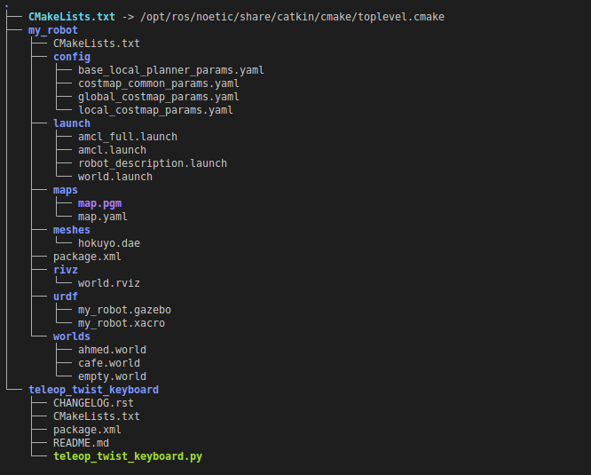
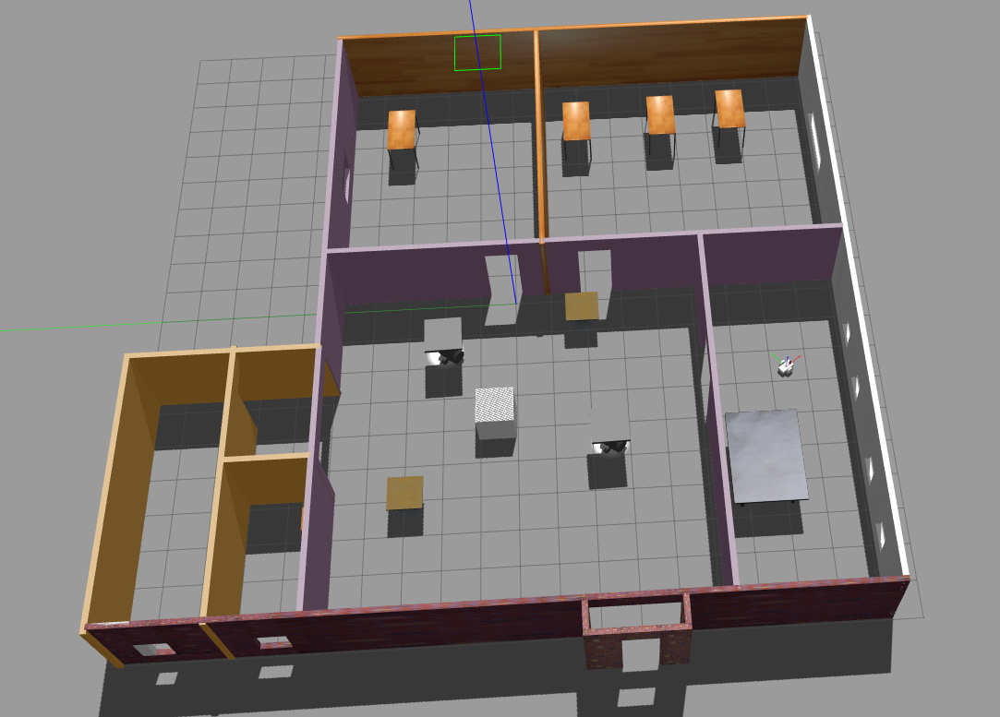
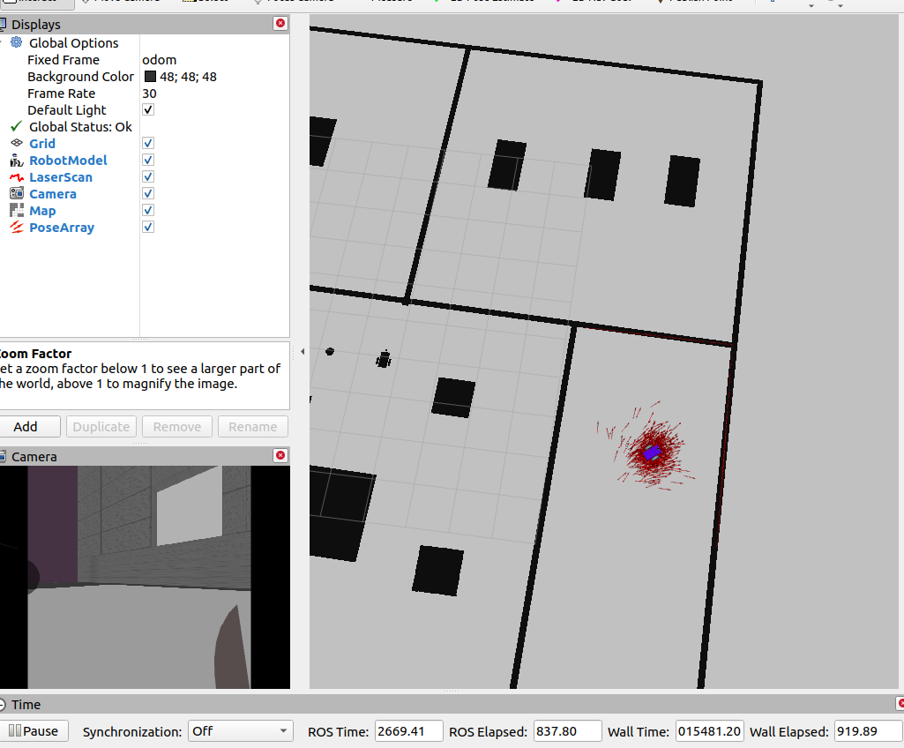
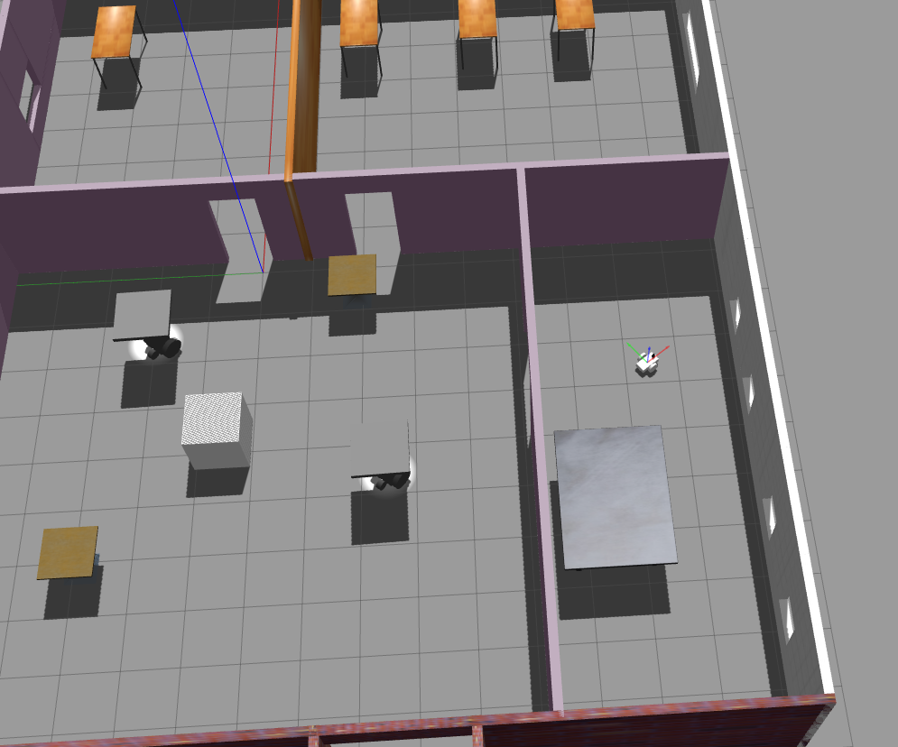

# Where_Am_I

## Goal

The purpose of this project is to implement the Adaptive Monte Carlo Localization (AMCL) algorithm to localize a robot in the world while it is in motion, controlled via the `teleop_twist_keyboard`. Additionally, the project utilizes `map_server` and `move_base` to load a Portable Gray Map (PGM) map of the world, annotated with laser scan data. The wheeled robot used in this project is based on the design from the [mobile_robot_ball_chaser](https://github.com/A-T-ELgammal/mobile_robot_ball_chaser) repository.

## Project Structure



## Output

1. **Whole Gazebo World Image:**
   

2. **AMCL Applied in RViz Output:**
   

3. **Robot in the Same Position in Gazebo:**
   

## Prerequisites (ROS Noetic)

Ensure the following ROS packages are installed:

```bash
sudo apt-get install ros-noetic-navigation
sudo apt-get install ros-noetic-map-server
sudo apt-get install ros-noetic-move-base
sudo apt-get install ros-noetic-amcl
```
Usage
Clone the repository:

bash
Copy code
git clone https://github.com/<your_username>/Where_Am_I.git
Build the ROS workspace:

bash
Copy code
cd Where_Am_I
catkin_make
Source the setup script:

bash
Copy code
source devel/setup.bash
Launch the project:

bash

for one launch command:
```bash
roslaunch my_robot amcl_full.launch 
```
for running the amcl in launch and world launch each in terminal:
```bash
roslaunch my_robot world.launch
roslaunch my_robot amcl.launch 
```
run teleop_twist_keyboard node to move the robot:
```bash
rosrun teleop_twist_keyboard teleop_twist_keyboard.py

```

##Notes
This project assumes the availability of a wheeled robot design, which should be cloned from the mobile_robot_ball_chaser repository.

Make sure to adjust the paths and names in the launch files accordingly to match your robot and package configurations.

The provided images showcase the entire Gazebo world, the output of AMCL applied in RViz, and the robot's position in Gazebo, demonstrating the successful application of the localization algorithm.

Feel free to explore, modify, and enhance this project according to your specific requirements.
